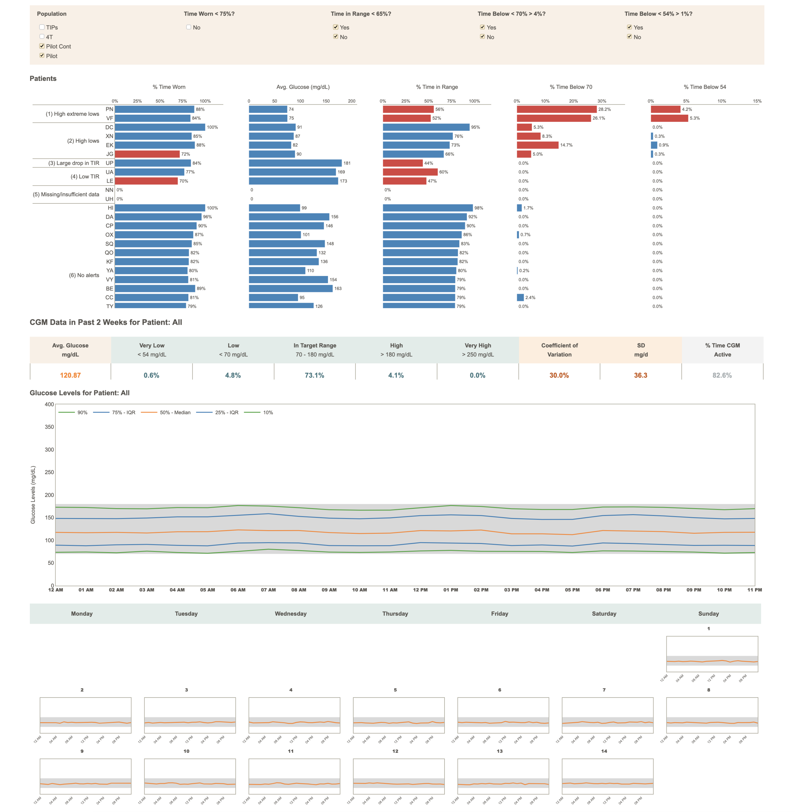
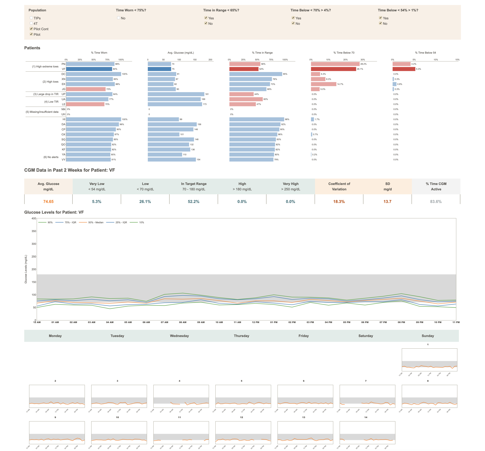

# Stanford TIDE


Timely Interventions for Diabetes Excellence (TIDE) is an open-source tool for the semi-automated analysis of 
population-level continuous glucose monitoring (CGM) data and for the algorithmic prioritization of patients with 
type 1 diabetes. 

The patient prioritization algorithm uses a flag system based on interpretable clinical criteria such as the percentage 
of glucose readings between 70 and 180 mg/dL (time-in-range or TIR), the percentage of glucose readings below 70 mg/dL 
(hypoglycemia) and the percentage of glucose readings below 54 mg/dL (clinically significant hypoglycemia). The clinical
indicators are calculated on the individual patients' blood glucose level time-series over the previous 14 days. 

The tool displays both aggregate population-level data and individual patient-level data, in which case the specific 
patient to view is selected interactively by the user by clicking on one of the patient's clinical indicators in the
patients panel. The tool is intended to be used by care providers on a weekly basis in order to identify the patients 
in more urgent need of review. 

This repository contains the Python implementation of TIDE, which is also available in [R and Tableau](https://github.com/jferstad/SURF-TIDE). 
This repository uses synthetic patients' blood glucose level time series stored in a static CSV file as this allows developers
to run the code directly without the need of obtaining the API credentials from a specific CGM device provider. The code in 
this repository has been deployed on [AWS Elastic Beanstalk](https://aws.amazon.com/elasticbeanstalk/) without changes, 
and the web interface can be accessed [here](http://stanford-tide-dashboard.eu-west-2.elasticbeanstalk.com/).

## Population View



## Patient View



## Usage

1. Clone the repository.

   ```shell
   git clone https://github.com/flaviagiammarino/stanford-tide-dashboard
   ```
   ```shell
   cd stanford-tide-dashboard
   ```

2. Install the requirements.

   ```shell
    pip install -r requirements.txt
    ```

3. Run the app.

   ```shell
    python3 application.py
    ```

## References

[1] Ferstad, J.O., Vallon, J.J., Jun, D., Gu, A., Vitko, A., Morales, D.P., Leverenz, J., Lee, M.Y., Leverenz, B., 
Vasilakis, C. and Osmanlliu, E., 2021. Population‐level management of type 1 diabetes via continuous glucose monitoring 
and algorithm‐enabled patient prioritization: Precision health meets population health. *Pediatric Diabetes*, 22(7), 
pp.982-991. [doi:10.2196/27284](https://doi.org/10.2196/27284)

[2] Scheinker, D., Gu, A., Grossman, J., Ward, A., Ayerdi, O., Miller, D., Leverenz, J., Hood, K., Lee, M.Y., Maahs, D.M. 
and Prahalad, P., 2022. Algorithm-Enabled, Personalized Glucose Management for Type 1 Diabetes at the Population Scale: 
Prospective Evaluation in Clinical Practice. *JMIR diabetes*, 7(2), p.e27284. 
[doi:10.1111/pedi.13256](https://doi.org/10.1111/pedi.13256)

[3] Scheinker, D., Prahalad, P., Johari, R., Maahs, D.M. and Majzun, R., 2022. A New Technology-Enabled Care Model for 
Pediatric Type 1 Diabetes. *NEJM Catalyst Innovations in Care Delivery*, 3(5), pp.CAT-21.
[doi:10.1056/CAT.21.04386](https://doi.org/10.1056/CAT.21.04386)
