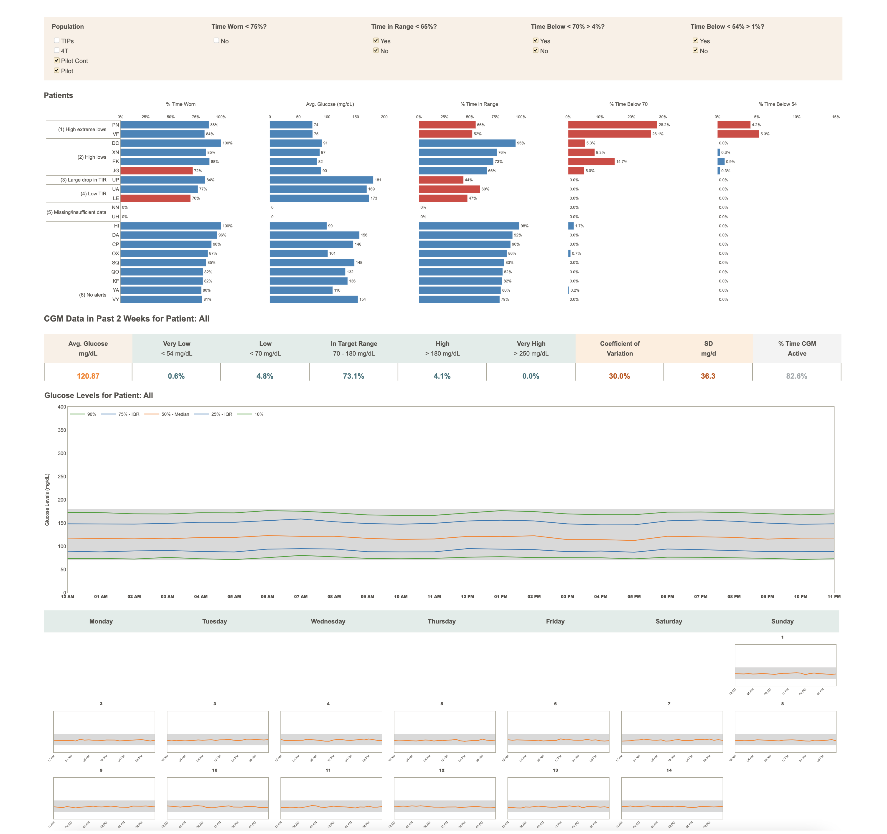

# Stanford TIDE Dashboard

Continuous glucose monitoring dashboard for algorithm-enabled prioritizations of patients with Type 1 diabetes 
introduced in Ferstad, J.O., Vallon, J.J., Jun, D., Gu, A., Vitko, A., Morales, D.P., Leverenz, J., Lee, M.Y., 
Leverenz, B., Vasilakis, C. and Osmanlliu, E., 2021. Population-level management of Type 1 diabetes via 
continuous glucose monitoring and algorithm-enabled patient prioritization: Precision health meets
population health. [medRxiv 2021.05.04.21256647](https://doi.org/10.1101/2021.05.04.21256647).



## Running the app on a local machine:

1. Clone the repository.

    ```
    git clone https://github.com/flaviagiammarino/stanford-tide-dashboard
    cd stanford-tide-dashboard
    ```

2. Install the requirements.

    ```
    pip install -r requirements.txt
    ```

3. Run the app.

    ```
    python3 application.py
    ```

## Deploying the app on the web with AWS Elastic Beanstalk:

1. Create a new web server environment using the latest Python 3 managed platform.
2. Compress all files repository and upload the zipped folder to the console. 
3. Make sure that the zipped folder does not contain any additional files, such as hidden system files and folders. 
